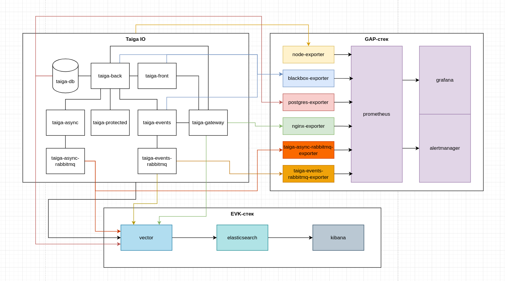

### Проектная работа 

Настройка мониторинга и логирования self-hosted приложения с использованием GAP (Grafana, Alertmanager и Prometheus) и EVK (Elasicsearch, Vector и Kibana) стеков

##### Основное приложение

В качестве приложения было использовано https://github.com/taigaio/taiga-docker/tree/main - Taiga IO - open-source приложение для отслеживания задач (а-ля Jira или Weeek)

Само приложение предоставляет компоуз с контейнерами 
- taiga-db - база данных postgresql
- taiga-back - бэк, написанный на python и django (метрики Django не выведены, пересобирать проект не стал)
- taiga-async - модуль обработки асинхронных событий
- taiga-async-rabbitmq - бэкенд для обработки асинхронных событий (RabbitMQ)
- taiga-front - фронтенд часть проекта
- taiga-events - обработчик событий
- taiga-events-rabbitmq - бэкенд разработчик событий
- taiga-protected - хранилка файлов
- taiga-gateway - nginx

Предстояло внедрить получение метрик и логгирование. Работа выполнялась в рамках одного компоуза (чтобы было проще оркестровать развертывание приложения).
Но в качестве идеи рассматривался вариант, когда приложение - это отдельный компоуз, GAP-стек - отдельный компоуз, EVK-стек - отдельный. Отказался от нее, так как необходимо было бы контролировать запущенность всех трех компоузов, и не запуаться в последовательности

##### Метрики - GAP стек

Развертывание началось с Prometheus и Grafana - т. е. получение и отображение метрик
Далее был настроены экспортеры:
- NodeExporter - для получение данных с ОС; в компоузе прокинул данные из хостовой системы в докер
- BlackboxExporter - для отслеживания состояния систем, предоставляющих REST API
- PostgresExporter - для получения метрик с postgresql
- NginxPrometheusExporter - для получения метрик с nginx
- RabbitMQExporter - для получения метрик с RabbitMQ

Далее настроил DataSource (Prometheus) и отображение этого DataSource в Grafana, подключил необходимые дашборды - те, что предлагаются экспортерами

В конце настроил подключил AlertManager, настроил следующие Alert
- падение какого-нибудь экспортера
- большой траффик на nginx
- не обрабатывается очередь на RMQ
- слишком большое потребление CPU
- слишком большое потребление RAM
- слишком большое потребление swap (так как у меня система при включении упирается в swap я решил задействовать алерт как определенную проверку)

По итогу у меня компоуз обогатился следующими сервисами
- prometheus
- node-exporter
- blackbox-exporter
- postgres-exporter
- nginx-exporter
- taiga-async-rabbitmq-exporter
- taiga-events-rabbitmq-exporter
- grafana
- alertmanager

##### Сбор метрик - EVK стек

В данной секции было развернуто логгирование. В качестве сборщика и доставщика использовался Vector. Vector собирает данные с файлов логов с Nginx, Postgres и RabbitMQ (не стал использовать filebeat, чтобы не нагружать итак перегруженный компоуз), при этом файлы дополнительно парсятся с использованием шаблона Grok; также он собирает данные с контейнеров приложения и GAP-стека через протокол fluentd. Из-за этого пришлось пересмотреть порядок оркестрации контейнера, добавить healthcheck-и, развесить зависимости, чтобы приложения не стартовали раньше Vector.
После настройки добавил ElasticSearch, через service setup добавил необходимые роли, после чего запустил сервис и добавил необходимые DataViews в Kibana:
- container_logs
- nginx_logs
- postgres_logs

По итогу в компоуз добавились следующие сервисы
- elasticsearch
- vector
- kibana

По итогу схема выглядит следующим образом

